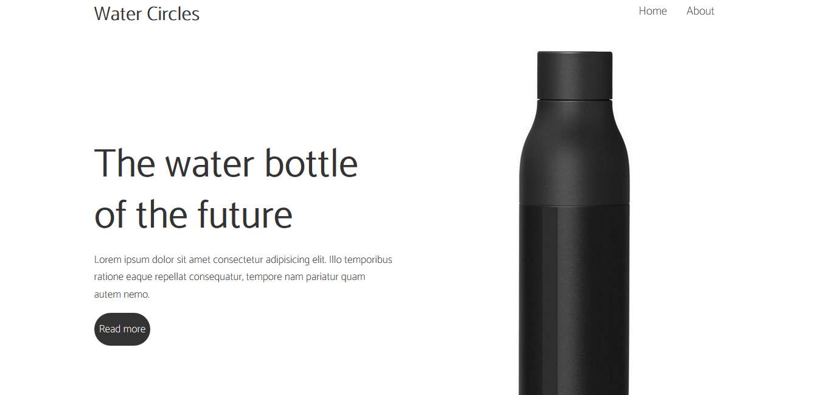
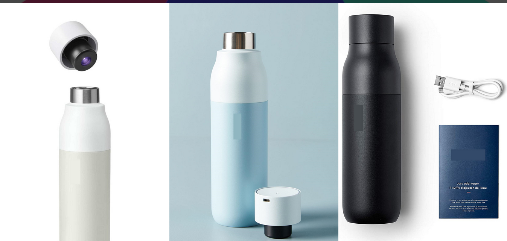

# Water-Circles Landing Page

This landing page uses HTML, CSS (grid, flex), Javascript, and jQuery. It is also compatible with mobile devices using media queries. The Simplelightbox library offers an excellent presentation of the images. This landing page is a multipurpose landing page template created by Stephane Andre.

## Preview

## Download and Installation

To start using this template, choose one of the following options to get started:

* Clone the repo: `git clone https://github.com/StephDigital/Water-Circles.git`
* [Fork, Clone, or Download on GitHub](https://github.com/StephDigital/Water-Circles)

## Usage

### Basic Usage

After downloading, edit HTML, CSS, and JavaScript with your text editor to make changes. These are the only files you should use. To preview the changes you make to the code, you can open the `index.html` file in your web browser.

## License

